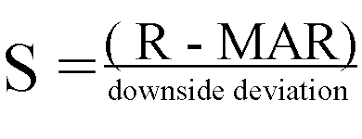

# Risk Adjusted Returns

A reward scheme that rewards the agent for increasing its net worth, while penalizing more volatile strategies.

### Overview

When trading you often are not just looking at the overall returns of your model. You're also looking at the overall volatility of your trading strategy over time compared to other metrics. The two major strategies here are the sharpe and sortino ratio.

The **sharpe ratio** looks at the overall movements of the portfolio and generates a penalty for massive movements through a lower score. This includes major movements towards the upside and downside.

The **sortino ratio** takes the same idea, though it focuses more on penalizing only the upside. That means it'll give a huge score for moments when the price moves upward, and will only give a negative score when the price drops heavily. This is a great direction for the RL algorithm. Seeing that we don't want to incur heavy downsides, yet want to take on large upsides, using this metric alone gives us lots of progress to mititgate downsides and increase upsides.

### Computing Reward

Given the choice of `return_algorithm` the reward is computed using the `risk_free_rate` and the `target_returns` parameters.

### Compatibility

### API Reference
