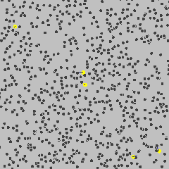

# FBMExchange

**Fractal Brownian Motion**

A simulated exchange, in which the price history is based off a fractional brownian motion model with supplied parameters.

## What is Fractal Brownian Motion?

Fractial Brownian Motion is apart of a class of differential equations called stochastic processes.

`Stochastic processes` are an accumulation of random variables that help us describe the emergence of a system over time. The power of them is that they can be used to describe all of the world around us. In fact, during early 1900 one of the first active uses of Stochastic Processes was with valuing stock options. It was called a Brownian Motion, developed by a French mathematician named Louis Bachelier. It can also be used for looking at random interactions of molecules over time. We use this method to solve reinforcement learning's sample inefficiency problem.

.

We generate prices, and train on that. Simple.

## Class Parameters

- `base_instrument`
  - The exchange symbol of the instrument to store/measure value in.
- `dtype`
  - A type or str corresponding to the dtype of the `observation_space`.
- `feature_pipeline`
  - A pipeline of feature transformations for transforming observations.

## Properties and Setters

- `base_instrument`
  - The exchange symbol of the instrument to store/measure value in.
- `dtype`
  - A type or str corresponding to the dtype of the `observation_space`.
- `feature_pipeline`
  - A pipeline of feature transformations for transforming observations.
- `base_precision`
  - The floating point precision of the base instrument.
- `instrument_precision`
  - The floating point precision of the instrument to be traded.
- `initial_balance`
  - The initial balance of the base symbol on the exchange.
- `balance`
  - The current balance of the base symbol on the exchange.
- `portfolio`
  - The current balance of each symbol on the exchange (non-positive balances excluded).
- `trades`
  - A list of trades made on the exchange since the last reset.
- `performance`
  - The performance of the active account on the exchange since the last reset.
- `generated_space`
  - The initial shape of the observations generated by the exchange, before feature transformations.
- `observation_columns`
  - The list of column names of the observation data frame generated by the exchange, before feature transformations.
- `observation_space`
  - The final shape of the observations generated by the exchange, after feature transformations.
- `net_worth`
  - Calculate the net worth of the active account on the exchange.
- `profit_loss_percent`
  - Calculate the percentage change in net worth since the last reset.
- `has_next_observation`
  - If `False`, the exchange's data source has run out of observations.
  - Resetting the exchange may be necessary to continue generating observations.

## Functions

Below are the functions that the `FBMExchange` uses to effectively operate.

### Private

- `_create_observation_generator`

### Public

- `has_next_observation`
  - Return the reward corresponding to the selected risk-adjusted return metric.
- `next_observation`
  - Generate the next observation from the exchange.
- `instrument_balance`
  - The current balance of the specified symbol on the exchange, denoted in the base instrument.
- `current_price`
  - The current price of an instrument on the exchange, denoted in the base instrument.
- `execute_trade`
  - Execute a trade on the exchange, accounting for slippage.
- `reset`
  - Reset the feature pipeline, initial balance, trades, performance, and any other temporary stateful data.

## Use Cases

**Use Case #1: Generate Price History for Exchange**

We generate the price history when

```py
from tensortrade.exchanges.simulated import FBMExchange

exchange = FBMExchange(base_instrument='BTC', timeframe='1h')
```
