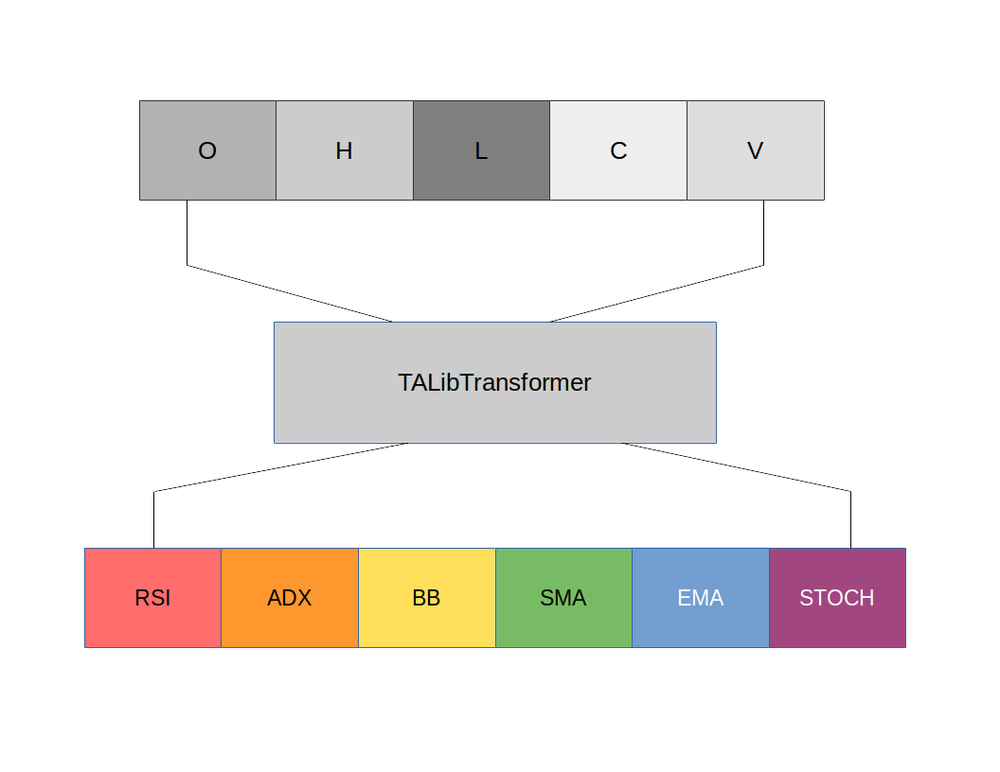

# TAlibIndicator

Adds one or more TAlib indicators to a data frame, based on existing open, high, low, and close column values.



## Class Parameters

- `indicators`
  - A list of indicators you want to transform the price information to.
- `lows`
  - The lower end of the observation space. See `spaces.Box` to best understand.
- `highs`
  - The lower end of the observation space. See `spaces.Box` to best understand.

## Properties and Setters

- **NONE**

## Functions

Below are the functions that the `TAlibIndicator` uses to effectively operate.

### Private

- `_str_to_indicator` - Converts the name of an indicator to an actual instance of the indicator. For a list of indicators see list [here](http://mrjbq7.github.io/ta-lib/).

### Public

- `transform`
  - Transform the data set and return a new data frame.

## Use Cases:

## Use Cases

**Use Case #1: Selecting Indicators**

The key advantage the `TAlibIndicator` has is that it allows us to dynamically set indicators according what's inside of a list. For instance, if we're trying to get the RSI and EMA together, we would run the following parameters inside ofthe indicator.

```py
talib_indicator = TAlibIndicator(["rsi", "ema"])
```

This runs through the indicators in the list, at runtime and matches them to what is seen inside of TA-Lib. The features are then flattened into the `output_space`, both into the `high` and `low` segment of `space.Box`.

```py
for i in range(len(self._indicators)):
    output_space.low = np.append(output_space.low, self._lows[i])
    output_space.high = np.append(output_space.high, self._highs[i])
```

Actual Use

```py
from tensortrade.features import FeaturePipeline
from tensortrade.features.scalers import MinMaxNormalizer
from tensortrade.features.stationarity import FractionalDifference
from tensortrade.features.indicators import TAlibIndicator
price_columns = ["open", "high", "low", "close"]
normalize_price = MinMaxNormalizer(price_columns)
moving_averages = TAlibIndicator(["EMA", "RSI", "BB"])
difference_all = FractionalDifference(difference_order=0.6)
feature_pipeline = FeaturePipeline(steps=[normalize_price,
                                          moving_averages,
                                          difference_all])
exchange.feature_pipeline = feature_pipeline
```
