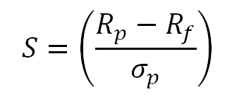
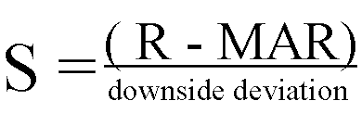

# Reward Scheme

Reward schemes receive the `TradingEnv` at each time step and return a `float`, corresponding to the benefit of that specific action. For example, if the action taken this step was a sell that resulted in positive profits, our `RewardScheme` could return a positive number to encourage more trades like this. On the other hand, if the action was a sell that resulted in a loss, the scheme could return a negative reward to teach the agent not to make similar actions in the future.

TensorTrade currently implements `SimpleProfit`, `RiskAdjustedReturns` and `PBR` (position-based returns), however more complex schemes can obviously be used instead.

Each reward scheme has a `reward` method, which takes in the `TradingEnv` at each time step and returns a `float` corresponding to the value of that action. As with action schemes, it is often necessary to store additional state within a reward scheme for various reasons. This state should be reset each time the reward scheme's reset method is called, which is done automatically when the environment is reset.

Ultimately the agent creates a sequence of actions to maximize its total reward over a given time. The `RewardScheme` is an abstract class that encapsulates how to tell the trading bot in `tensortrade` if it's trading positively or negatively over time. The same methods will be called each time for each step, and we can directly swap out compatible schemes.

```python
from tensortrade.env.default.rewards import SimpleProfit

reward_scheme = SimpleProfit()
```


## Simple Profit
A reward scheme that simply rewards the agent for profitable trades, no matter how it got there.

#### Overview
The simple profit scheme needs to keep a history of profit over time. The way it does this is through looking at the portfolio as a means of keeping track of how the portfolio moves. This is seen inside of the `get_reward` function.

#### Computing Reward
Reward is calculated as the cumulative percentage change in net worth over the previous `window_size` time steps

<hr>

## Risk Adjusted Returns
A reward scheme that rewards the agent for increasing its net worth, while penalizing more volatile strategies.

#### Overview
When trading you often are not just looking at the overall returns of your model. You're also looking at the overall volatility of your trading strategy over time compared to other metrics. The two major strategies here are the sharpe and sortino ratio.

The **sharpe ratio** looks at the overall movements of the portfolio and generates a penalty for massive movements through a lower score. This includes major movements towards the upside and downside.



The **sortino ratio** takes the same idea, though it focuses more on penalizing only the upside. That means it'll give a huge score for moments when the price moves upward, and will only give a negative score when the price drops heavily. This is a great direction for the RL algorithm. Seeing that we don't want to incur heavy downsides, yet want to take on large upsides, using this metric alone gives us lots of progress to mititgate downsides and increase upsides.



#### Computing Reward
Given the choice of `return_algorithm` the reward is computed using the `risk_free_rate` and the `target_returns` parameters.

<hr>

## Position-based returns (PBR)

#### Computing Reward

* Let <code>P<sub>t</sub></code> denote the price at time t, and <code>P<sub>t-1</sub></code> denote the price at time t-1
* Let <code>X<sub>t</sub></code> denote the position at time t.
* Let <code>R<sub>t</sub></code> denote the reward at time t.

Then the reward is defined as <code>R<sub>t</sub> = (P<sub>t</sub> - P<sub>t-1</sub>) &middot; X<sub>t</sub></code>

