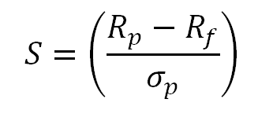
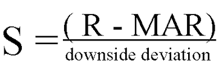

# Risk Adjusted Returns

A reward scheme that rewards the agent for increasing its net worth, while penalizing more volatile strategies.

## What are risk adjusted models?

When trading you often are not just looking at the overall returns of your model. You're also looking at the overall volatility of your trading strategy over time compared to other metrics. The two major strategies here are the sharpe and sortino ratio.

The **sharpe ratio** looks at the overall movements of the portfolio and generates a penalty for massive movements through a lower score. This includes major movements towards the upside and downside.

The **sortino ratio** takes the same idea, though it focuses more on penalizing only the upside. That means it'll give a huge score for moments when the price moves upward, and will only give a negative score when the price drops heavily. This is a great direction for the RL algorithm. Seeing that we don't want to incur heavy downsides, yet want to take on large upsides, using this metric alone gives us lots of progress to mititgate downsides and increase upsides.

## Class Parameters

- `return_algorithm`
  - The risk-adjusted return metric to use. Options are 'sharpe' and 'sortino'. Defaults to 'sharpe'.
- `risk_free_rate`
  - The risk free rate of returns to use for calculating metrics. Defaults to 0.
- `target_returns`
  - The target returns per period for use in calculating the sortino ratio. Default to 0.

## Functions

Below are the functions that the `RiskAdjustedReturns` uses to effectively operate.

### Private

- `_return_algorithm_from_str`
  - Allows us to dynamically choose an algorithm for the reward within a given selection. We can choose between either sharpe or sortino ratios. Each are volatility models we've discussed above.
- `_sharpe_ratio`
  - Return the sharpe ratio for a given series of a returns.
- `_sortino_ratio`
  - Return the sortino ratio for a given series of a returns.

### Public

- `get_reward`
  - Return the reward corresponding to the selected risk-adjusted return metric.

## Use Cases

...
