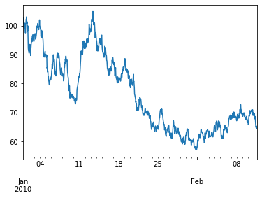
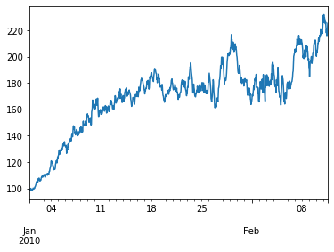
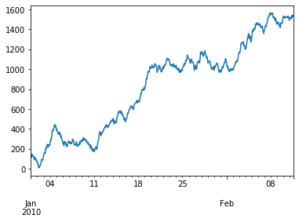
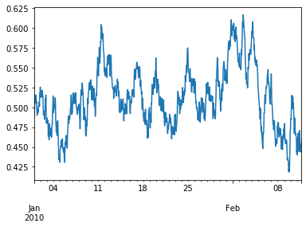
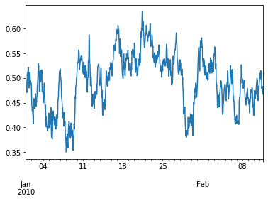

# Stochastic Data

<br>**Generating Price Data using Stocastic Processes**<br>

* Geometric Brownian Motion (GBM)
* Fractional Brownian Motion (FBM)
* Heston Stochastic Volatility Model
* Cox Ingersoll Ross (CIR)
* Ornstein Uhlebneck stochastic process


<br>**Model Parameters**<br>

The model parameters class contains all of the parameters used by the following stochastic processes. The parameters have been prefixed with the name of the stochastic process they are used in. Calibration of the stochastic processes would involve looking for the parameter values which best fit some historical data.
*   `all_s0` This is the starting asset value
*   `all_time` This is the amount of time to simulate for
*   `all_delta` This is the delta, the rate of time e.g. 1/252 = daily, 1/12 = monthly
*   `all_sigma` This is the volatility of the stochastic processes
*   `gbm_mu` This is the annual drift factor for geometric brownian motion
*   `jumps_lamda` This is the probability of a jump happening at each point in time
*   `jumps_sigma` This is the volatility of the jump size
*   `jumps_mu` This is the average jump size
*   `cir_a` This is the rate of mean reversion for Cox Ingersoll Ross
*   `cir_mu` This is the long run average interest rate for Cox Ingersoll Ross
*   `all_r0` This is the starting interest rate value
*   `cir_rho` This is the correlation between the wiener processes of the Heston model
*   `ou_a` This is the rate of mean reversion for Ornstein Uhlenbeck
*   `ou_mu` This is the long run average interest rate for Ornstein Uhlenbeck
*   `sheston_a` This is the rate of mean reversion for volatility in the Heston model
*   `heston_mu` This is the long run average volatility for the Heston model
*   `heston_vol0` This is the starting volatility value for the Heston model


```python
import random

import tensortrade.stochastic as sp

%matplotlib inline
```

<br>**Geometric Brownian Motion**<br>


```python
data = sp.gbm(
    base_price=100,
    base_volume=5,
    start_date="2010-01-01",
    times_to_generate=1000,
    time_frame='1H'
)

data.close.plot()
```



<br>**Heston Stochastic Volatility Model**<br>


```python
data = sp.heston(
    base_price=100,
    base_volume=5,
    start_date="2010-01-01",
    times_to_generate=1000,
    time_frame='1H'
)

data.close.plot()
```




<br>**Fractional Brownian Motion**<br>


```python
data = sp.fbm(
    base_price=100,
    base_volume=5,
    start_date="2010-01-01",
    times_to_generate=1000,
    time_frame='1H'
)

data.close.plot()
```




<br>**Cox Ingersoll Ross (CIR)**<br>


```python
data = sp.cox(
    base_price=100,
    base_volume=5,
    start_date="2010-01-01",
    times_to_generate=1000,
    time_frame='1H'
)

data.close.plot()
```




<br>**Ornstein Uhlenbeck Process**<br>

```python
data = sp.ornstein(
    base_price=100,
    base_volume=5,
    start_date="2010-01-01",
    times_to_generate=1000,
    time_frame='1H'
)

data.close.plot()
```


