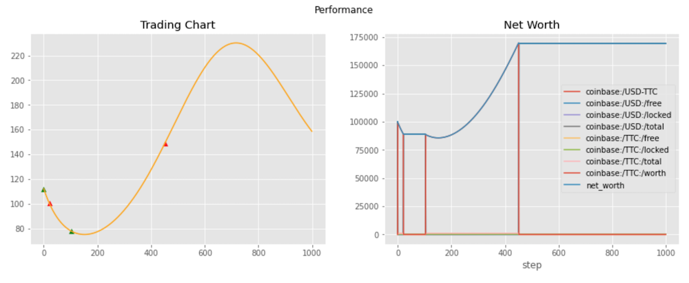

# Using Ray with TensorTrade

In this tutorial, we are going to learn how to use `ray` with TensorTrade in order to create a profitable algorithm on a predictable sine curve. You may be asking yourself, why use something so simple when the real world data is much more difficult to predict? Now this is a very good question and there is a simple answer.

> "The man who moves a mountain begins by carrying away small stones.”
>> \- Confucius

Before trying to jump into the world of complex trading environments, a simple sine curve can be used to perform a sanity check on your trading algorithm. The reward and action scheme you use should be able to make money on the predictable pattern of a sine curve. If it does not, then you know there is no possibility success will be found on a more complex environment. There are some answers we would like to know fast before we waste time and resources in developing an algorithm which are and one of them is, does our `RewardScheme` correctly specify the goal we are after?

In this tutorial we will propose a new reward scheme and action scheme and show that you can actually have the reward scheme be dependent on the action scheme. This will be done through the use of a `DataFeed`. We first, however, need to install `ray`.

```bash
!pip install ray==0.8.7
!pip install symfit
```

We will begin by defining the two instruments we want to define our portfolio with. We will be using the U.S. dollar and fake coin called TensorTrade Coin.

```python
from tensortrade.oms.instruments import Instrument

USD = Instrument("USD", 2, "U.S. Dollar")
TTC = Instrument("TTC", 8, "TensorTrade Coin")
```

Now let us look at the curve we will be using to define our price.


Ideally, what we will be expecting from our agent is that it will be able to sell at the peaks and buy at the troughs. We will move on to defining our action scheme. The `ActionScheme` we are going to build is going to be extremely simple. There are only 3 states that our agent can be in which are `buy`, `sell`, and `hold`. We will make use of a new function in the library, `proportion_order`. This function enables the user to make an order that can take a percentage of funds at a particular wallet and send it to another. Therefore, we want to structure a way to only have two actions in our scheme and use them as indicators to move our funds to the opposite wallet.


```python
from gym.spaces import Discrete

from tensortrade.env.default.actions import TensorTradeActionScheme

from tensortrade.env.generic import ActionScheme, TradingEnv
from tensortrade.core import Clock
from tensortrade.oms.instruments import ExchangePair
from tensortrade.oms.wallets import Portfolio
from tensortrade.oms.orders import (
    Order,
    proportion_order,
    TradeSide,
    TradeType
)


class BSH(TensorTradeActionScheme):

    registered_name = "bsh"

    def __init__(self, cash: 'Wallet', asset: 'Wallet'):
        super().__init__()
        self.cash = cash
        self.asset = asset

        self.listeners = []
        self.action = 0

    @property
    def action_space(self):
        return Discrete(2)

    def attach(self, listener):
        self.listeners += [listener]
        return self

    def get_orders(self, action: int, portfolio: 'Portfolio'):
        order = None

        if abs(action - self.action) > 0:
            src = self.cash if self.action == 0 else self.asset
            tgt = self.asset if self.action == 0 else self.cash
            order = proportion_order(portfolio, src, tgt, 1.0)
            self.action = action

        for listener in self.listeners:
            listener.on_action(action)

        return [order]

    def reset(self):
        super().reset()
        self.action = 0
```

Next, we want to create our reward scheme to reflect how well we are positioned in the environment. Essentially, we want to make a mapping that shows how we would like our rewards to be reflected for each state we are in. The following shows such a mapping:


State | Price Up | Price Down |
----- | -------- | ---------- |
All funds in `cash` wallet (0) | - | + |
All funds in `asset` wallet (1) | + | - |

The signs in the table show what we would like the sign of the rewards to be. The position-based reward scheme (PBR) achieves this mapping.

```python
from tensortrade.env.default.rewards import TensorTradeRewardScheme
from tensortrade.feed.core import Stream, DataFeed


class PBR(TensorTradeRewardScheme):

    registered_name = "pbr"

    def __init__(self, price: 'Stream'):
        super().__init__()
        self.position = -1

        r = Stream.sensor(price, lambda p: p.value, dtype="float").diff()
        position = Stream.sensor(self, lambda rs: rs.position, dtype="float")

        reward = (r * position).fillna(0).rename("reward")

        self.feed = DataFeed([reward])
        self.feed.compile()

    def on_action(self, action: int):
        self.position = -1 if action == 0 else 1

    def get_reward(self, portfolio: 'Portfolio'):
        return self.feed.next()["reward"]

    def reset(self):
        self.position = -1
        self.feed.reset()
```

Finally, we would like to make sure we can see if the agent is selling at the peaks and buying at the troughs. We will make a quick `Renderer` that can show this information using `Matplotlib`.

```python
import numpy as np
import pandas as pd
import matplotlib.pyplot as plt

from tensortrade.env.generic import Renderer


class PositionChangeChart(Renderer):

    def __init__(self, color: str = "orange"):
        self.color = "orange"

    def render(self, env, **kwargs):
        history = pd.DataFrame(env.observer.renderer_history)

        actions = list(history.action)
        p = list(history.price)

        buy = {}
        sell = {}

        for i in range(len(actions) - 1):
            a1 = actions[i]
            a2 = actions[i + 1]

            if a1 != a2:
                if a1 == 0 and a2 == 1:
                    buy[i] = p[i]
                else:
                    sell[i] = p[i]

        buy = pd.Series(buy)
        sell = pd.Series(sell)

        fig, axs = plt.subplots(1, 2, figsize=(15, 5))

        fig.suptitle("Performance")

        axs[0].plot(np.arange(len(p)), p, label="price", color=self.color)
        axs[0].scatter(buy.index, buy.values, marker="^", color="green")
        axs[0].scatter(sell.index, sell.values, marker="^", color="red")
        axs[0].set_title("Trading Chart")

        performance_df = pd.DataFrame().from_dict(env.action_scheme.portfolio.performance, orient='index')
        performance_df.plot(ax=axs[1])
        axs[1].set_title("Net Worth")

        plt.show()
```

<br>**Train**<br>
Now in order to use our custom environment in `ray` we must first write a function that creates an instance of the `TradingEnv` from a configuration dictionary.

```python
import ray
import numpy as np
import pandas as pd

from ray import tune
from ray.tune.registry import register_env

import tensortrade.env.default as default

from tensortrade.feed.core import DataFeed, Stream
from tensortrade.oms.exchanges import Exchange
from tensortrade.oms.services.execution.simulated import execute_order
from tensortrade.oms.wallets import Wallet, Portfolio


def create_env(config):
    x = np.arange(0, 2*np.pi, 2*np.pi / 1001)
    y = 50*np.sin(3*x) + 100

    x = np.arange(0, 2*np.pi, 2*np.pi / 1000)
    p = Stream.source(y, dtype="float").rename("USD-TTC")

    bitfinex = Exchange("bitfinex", service=execute_order)(
        p
    )

    cash = Wallet(bitfinex, 100000 * USD)
    asset = Wallet(bitfinex, 0 * TTC)

    portfolio = Portfolio(USD, [
        cash,
        asset
    ])

    feed = DataFeed([
        p,
        p.rolling(window=10).mean().rename("fast"),
        p.rolling(window=50).mean().rename("medium"),
        p.rolling(window=100).mean().rename("slow"),
        p.log().diff().fillna(0).rename("lr")
    ])

    reward_scheme = PBR(price=p)

    action_scheme = BSH(
        cash=cash,
        asset=asset
    ).attach(reward_scheme)

    renderer_feed = DataFeed([
        Stream.source(y, dtype="float").rename("price"),
        Stream.sensor(action_scheme, lambda s: s.action, dtype="float").rename("action")
    ])

    environment = default.create(
        feed=feed,
        portfolio=portfolio,
        action_scheme=action_scheme,
        reward_scheme=reward_scheme,
        renderer_feed=renderer_feed,
        renderer=PositionChangeChart(),
        window_size=config["window_size"],
        max_allowed_loss=0.6
    )
    return environment

register_env("TradingEnv", create_env)
```

Now that the environment is registered we can run the training algorithm using the Proximal Policy Optimization (PPO) algorithm implemented in `rllib`.

```python
analysis = tune.run(
    "PPO",
    stop={
      "episode_reward_mean": 500
    },
    config={
        "env": "TradingEnv",
        "env_config": {
            "window_size": 25
        },
        "log_level": "DEBUG",
        "framework": "torch",
        "ignore_worker_failures": True,
        "num_workers": 1,
        "num_gpus": 0,
        "clip_rewards": True,
        "lr": 8e-6,
        "lr_schedule": [
            [0, 1e-1],
            [int(1e2), 1e-2],
            [int(1e3), 1e-3],
            [int(1e4), 1e-4],
            [int(1e5), 1e-5],
            [int(1e6), 1e-6],
            [int(1e7), 1e-7]
        ],
        "gamma": 0,
        "observation_filter": "MeanStdFilter",
        "lambda": 0.72,
        "vf_loss_coeff": 0.5,
        "entropy_coeff": 0.01
    },
    checkpoint_at_end=True
)
```

After training is complete, we would now like to get access to the agents policy. We can do that by restoring the agent using the following code.

```python
import ray.rllib.agents.ppo as ppo

# Get checkpoint
checkpoints = analysis.get_trial_checkpoints_paths(
    trial=analysis.get_best_trial("episode_reward_mean"),
    metric="episode_reward_mean",
    mode='max'
)
checkpoint_path = checkpoints[0][0]

# Restore agent
agent = ppo.PPOTrainer(
    env="TradingEnv",
    config={
        "env_config": {
            "window_size": 25
        },
        "framework": "torch",
        "log_level": "DEBUG",
        "ignore_worker_failures": True,
        "num_workers": 1,
        "num_gpus": 0,
        "clip_rewards": True,
        "lr": 8e-6,
        "lr_schedule": [
            [0, 1e-1],
            [int(1e2), 1e-2],
            [int(1e3), 1e-3],
            [int(1e4), 1e-4],
            [int(1e5), 1e-5],
            [int(1e6), 1e-6],
            [int(1e7), 1e-7]
        ],
        "gamma": 0,
        "observation_filter": "MeanStdFilter",
        "lambda": 0.72,
        "vf_loss_coeff": 0.5,
        "entropy_coeff": 0.01
    }
)
agent.restore(checkpoint_path)
```


Now let us get a visualization of the agent's decision making on our sine curve example by rendering the environment.

```python
# Instantiate the environment
env = create_env({
    "window_size": 25
})

# Run until episode ends
episode_reward = 0
done = False
obs = env.reset()

while not done:
    action = agent.compute_action(obs)
    obs, reward, done, info = env.step(action)
    episode_reward += reward

env.render()
```


From the rendering, you can see that the agent is making near optimal decisions on the environment. Now we want to put the agent in an environment it is not used to and see what kind of decisions it makes. We will use for our price, an `order` 5 Fourier series fitted to a randomly generated Geometric Brownian Motion (GBM). We will use the `symfit` library to do this.

```python
from symfit import parameters, variables, sin, cos, Fit


def fourier_series(x, f, n=0):
    """Creates a symbolic fourier series of order `n`.

    Parameters
    ----------
    x : `symfit.Variable`
        The input variable for the function.
    f : `symfit.Parameter`
        Frequency of the fourier series
    n : int
        Order of the fourier series.
    """
    # Make the parameter objects for all the terms
    a0, *cos_a = parameters(','.join(['a{}'.format(i) for i in range(0, n + 1)]))
    sin_b = parameters(','.join(['b{}'.format(i) for i in range(1, n + 1)]))

    # Construct the series
    series = a0 + sum(ai * cos(i * f * x) + bi * sin(i * f * x)
                     for i, (ai, bi) in enumerate(zip(cos_a, sin_b), start=1))
    return series


def gbm(price: float,
        mu: float,
        sigma: float,
        dt: float,
        n: int) -> np.array:
    """Generates a geometric brownian motion path.

    Parameters
    ----------
    price : float
        The initial price of the series.
    mu : float
        The percentage drift.
    sigma : float
        The percentage volatility.
    dt : float
        The time step size.
    n : int
        The number of steps to be generated in the path.

    Returns
    -------
    `np.array`
        The generated path.
    """
    y = np.exp((mu - sigma ** 2 / 2) * dt + sigma * np.random.normal(0, np.sqrt(dt), size=n).T)
    y = price * y.cumprod(axis=0)
    return y


def fourier_gbm(price, mu, sigma, dt, n, order):

    x, y = variables('x, y')
    w, = parameters('w')
    model_dict = {y: fourier_series(x, f=w, n=order)}

    # Make step function data
    xdata = np.arange(-np.pi, np.pi, 2*np.pi / n)
    ydata = np.log(gbm(price, mu, sigma, dt, n))

    # Define a Fit object for this model and data
    fit = Fit(model_dict, x=xdata, y=ydata)
    fit_result = fit.execute()

    return np.exp(fit.model(x=xdata, **fit_result.params).y)
```

Now we can make the evaluation environment and see how the agent performs.

```python
def create_eval_env(config):
    y = config["y"]

    x = np.arange(0, 2*np.pi, 2*np.pi / 1000)
    p = Stream.source(y, dtype="float").rename("USD-TTC")

    bitfinex = Exchange("bitfinex", service=execute_order)(
        p
    )

    cash = Wallet(bitfinex, 100000 * USD)
    asset = Wallet(bitfinex, 0 * TTC)

    portfolio = Portfolio(USD, [
        cash,
        asset
    ])

    feed = DataFeed([
        p,
        p.rolling(window=10).mean().rename("fast"),
        p.rolling(window=50).mean().rename("medium"),
        p.rolling(window=100).mean().rename("slow"),
        p.log().diff().fillna(0).rename("lr")
    ])

    reward_scheme = PBR(price=p)

    action_scheme = BSH(
        cash=cash,
        asset=asset
    ).attach(reward_scheme)

    renderer_feed = DataFeed([
        Stream.source(y, dtype="float").rename("price"),
        Stream.sensor(action_scheme, lambda s: s.action, dtype="float").rename("action")
    ])

    environment = default.create(
        feed=feed,
        portfolio=portfolio,
        action_scheme=action_scheme,
        reward_scheme=reward_scheme,
        renderer_feed=renderer_feed,
        renderer=PositionChangeChart(),
        window_size=config["window_size"],
        max_allowed_loss=0.6
    )
    return environment

# Instantiate the environment
env = create_eval_env({
    "window_size": 25,
    "y": fourier_gbm(price=100, mu=0.01, sigma=0.5, dt=0.01, n=1000, order=5)
})


# Run until episode ends
episode_reward = 0
done = False
obs = env.reset()

while not done:
    action = agent.compute_action(obs)
    obs, reward, done, info = env.step(action)
    episode_reward += reward
```


The following are a few examples of the rendering that came from the evaluation environment.





As you can see, the agent has been able to make correct decisions on some of the price curves, but not all of them. The last curve shows some of the shortcomings of the agent. The agent seemed to have stop making decisions to move its wealth to capitalize on the changes in price. In the first three, however, it was able to make those decisions. The reason for this is most likely the change in the frequency of the curve. The last chart has a price curve that is volatile, containing many local maxima and minima as opposed to the first three charts.

<br>**What have we learned?**<br>
* Make an environment in TT.
* Create a custom `ActionScheme`, `RewardScheme`, and `Renderer` in TT.
* Using a simple price curve to understand more about actions and rewards in our use case.
* Using `ray` to train and restore an agent.
* Making evaluation environments for providing insight into the decisions of an agent.

See you in the next tutorial!
